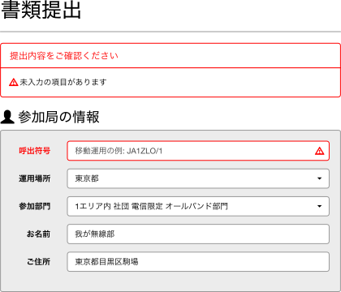
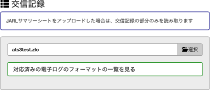
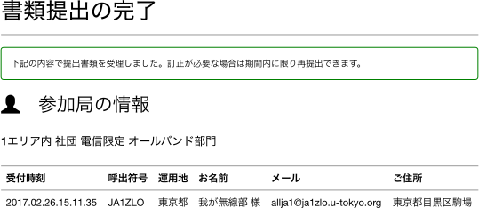
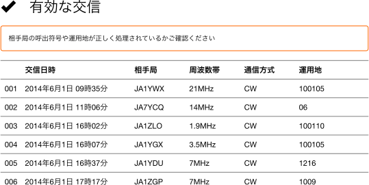

* TOC
{:toc}
## 1 はじめに

本稿で解説する**自動集計システム**は、アマチュア無線のコンテストの効率的な運営を支援する、**ウェブシステム**である。
[ALLJA1コンテスト](https://ja1zlo.u-tokyo.org/allja1)を対象に、参加者の集計と結果発表を迅速化する目的で整備された。2014年以来の運用実績がある。

### 1.1 開発の経緯

[ALLJA1コンテスト](https://ja1zlo.u-tokyo.org/allja1)は毎年6月の開催だが、2009年に部員が数名に減勢した我が無線部では、開催困難な状況に陥った。
運営業務は、以下の3段階に区分できるが、開催後の業務の負担が課題で、結果発表が年度末まで遅延する有様だった。

|-|-|
|---|---|
|開催前の業務 | 規約策定と告知 |
|開催中の業務 | 開催状況の把握 |
|開催後の業務 | 書類受付 $$\cdot$$ 採点 $$\cdot$$ 審査 $$\cdot$$ 暫定結果発表 $$\cdot$$ 最終結果発表 $$\cdot$$ 賞状発送|

2010年の増勢により、当面は開催を継続する方針に決着したが、外部に運営を委託する可能性も検討される状況だった。
駒場には委託に抵抗を感じる学生もおり、単独での運営を継続するために整備を始めたのが、下記のシステム群である。

|-|-|-|-|
|---|---|---|---|
|ATS-1型 | 2012年 | 第25回 | 部分的なサマリーシートの自動処理の実現 |
|ATS-2型 | 2013年 | 第26回 | 書類解析の厳密かとウェブ書類受付の実現 |
|ATS-3型 | 2014年 | 第27回 | 書類解析と暫定結果発表のリアルタイム化 |
|ATS-4型 | 2017年 | 第30回 | 自動集計システムとコンテスト規約の分離|

2013年には、交信記録を完全に自動処理できるATS-2型を試作し、悲願だった、締切から2日での結果速報を達成した。
2021年には、従来の[ALLJA1コンテスト](https://ja1zlo.u-tokyo.org/allja1)に加え、JS2FVOらの発案で[リアルタイムコンテスト](https://ja1zlo.u-tokyo.org/rt/rt1.html)の運営業務にも対応した。

### 1.2 実装の公開

現行のATS-4型の完全な実装は、GitHubで無償公開している。Gitを利用して、以下の操作で最新の実装を取得できる。

```bash
$ git clone https://github.com/nextzlog/ats4
```

以下の操作で起動できる。ただし、ATS-4型の開発言語はScalaなので、ATS-4型のビルドと起動には[sbt](https://scala-sbt.org)が必要である。

```bash
$ cd ats4
$ sbt "start -Dhttp.port=8000"
```

ATS-4型では、交信記録の解析や得点計算を再利用可能な形で整備した。これがqxslである。以下の操作で取得できる。

```bash
$ git clone https://github.com/nextzlog/qxsl
```

ATS-4型の特色は、**ドメイン特化言語**による規約の定義を修正すれば、容易に様々なコンテストに移植可能な点にある。
具体的には、交信記録の解析や得点計算が、RubyやLISPで記述される。以下に、対応済みの規約と、その実装を示す。

|-|-|
|---|---|
|[電通大コンテスト](https://www.ja1zgp.com)の例 | [https://github.com/nextzlog/ats4/blob/master/conf/rules/uec.rb](https://github.com/nextzlog/ats4/blob/master/conf/rules/uec.rb) |
|[多摩川コンテスト](http://apollo.c.ooco.jp)の例 | [https://github.com/nextzlog/ats4/blob/master/conf/rules/tama.rb](https://github.com/nextzlog/ats4/blob/master/conf/rules/tama.rb)|

我が無線部では、全てのコンテストがATS-4型を活用する将来を構想しており、ATS-4型の移植は、無償で受け付ける。

## 2 従来方式

我が無線部では、開催後の書類受付の要領を抜本的に見直し、書類の曖昧性を排除して、自動処理する方法を模索した。
日本国内のコンテストでは、[JARL](https://jarl.org)が推奨する**サマリーシート**を、電子メールに添付して提出する方法が標準的である。

```bash
<SUMMARYSHEET VERSION=R2.0>
<CALLSIGN>JA1ZLO</CALLSIGN>
<TOTALSCORE>64</TOTALSCORE>
<CONTESTNAME>ALLJA1</CONTESTNAME>
<CATEGORYCODE>XMAH</CATEGORYCODE>
<LOGSHEET TYPE=ZLOG>
mon day time  callsign      sent         rcvd      multi   MHz mode pts memo
  6   1 0932 JA1YAD     100110       59100110     100110    14 SSB  1   
  6   1 0956 JA1YYE     100110       5913009      13009     28 SSB  1   
  6   1 1002 JA1YXP     100110       59134404     134404    50 AM   1   
  6   1 1027 JR1ZTT     100110       591420       1420      21 SSB  1   
  6   1 1629 JA1YCG     100110       59110109     110109     7 SSB  1   
  6   1 1637 JA1YDU     100110       5991216      1216       7 CW   1   
  6   1 1717 JA1ZGP     100110       5991009      1009       7 CW   1   
  6   1 1738 JA1YGX     100110       59100105     100105     7 SSB  1   
</LOGSHEET>
</SUMMARYSHEET>
```

交信記録に加え、参加者の氏名や連絡先に、参加部門を記載する。しかし、曖昧性が高く、自動処理には不適切である。
例えば、ATS-1型の開発段階では、参加部門を確定する際に、その曖昧さ故に、稚拙な判別方法を採用する必要があった。

|-|-|
|---|---|
|電信と電話の判別 | 要素CATEGORYNAMEの値に語「**電話**」があれば**電信電話**部門 |
|運用エリアの検査 | 要素CATEGORYNAMEの値に語「**内**」があれば**関東エリア**部門 |
|社団と個人の判別 | 要素CATEGORYNAMEの値に語「**マルチ**」があれば**社団局**部門|

また、交信の日時や相手や周波数を記載したLOGSHEETの部分には、規格化された書式がなく、実質的には自由欄だった。
交信を記録するソフトウェア毎に独自の書式が乱立して、構造や属性の形式的な定義も提供されず、曖昧な状態である。

```bash
<LOGSHEET TYPE=JA1ZLO-ORIGINAL-FORMAT>
```

曖昧な類似性を標準規格と嘯く有様である。属性には複数の意味が存在し、以下の2行は、同じ意味や異なる意味になる。

```bash
2015-06-07 09:01   JA1YWX   100105
2015-06-07 09:01   JA1YWX   59100105
```

国際的なコンテストの場合は、交信記録の書式を厳格に規定した事例があり、[Cabrillo](https://wwrof.org/cabrillo/)や[ADIF](https://adif.org)が代表的な書式である。
前者はコンテスト毎に詳細が異なり、交信を記録するソフトウェア側で個別のコンテストの書式に対応する必要がある。

```bash
START-OF-LOG: 3.0
CALLSIGN: JA1ZLO
QSO:  7000 CW 1919-08-10 0364 JA1ZLO        599 114514 JA1YWX        599 889464 0
QSO:  7000 CW 1919-08-10 0364 JA1ZLO        599 114514 JA1YWX        599 889464 0
```

後者は、規格が厳密で拡張性もあるが、名前空間の概念がなく、独自に定義された属性の名前が重複する可能性がある。
独自定義の属性を自動的に検証する仕組みも、参加部門の曖昧さを解決する仕組みもなく、運用次第では曖昧さが残る。

```bash
<CALL:6>QI1JDS<QSO_DATE:8>20170604<time_on:6>000000<MODE:2>CW<band:3>10m<RST_RCVD:3>599<SRX:4>1005<eor>
<CALL:6>QD2LVE<QSO_DATE:8>20170604<time_on:6>000100<MODE:2>CW<band:3>20m<RST_RCVD:3>599<SRX:4>1336<eor>
```

## 3 書類提出

第2章で提起した問題意識から、我が無線部ではウェブ提出の仕組みを構築して、電子メールでの書類受付を廃止した。
ATS-3型の開発では、PCの操作が苦手な参加者に配慮して、無駄な画面遷移を排除し、**ユーザビリティ**の確保に努めた。

### 3.1 書類提出の開始

参加者は交信記録を準備して、ATS-4型にアクセスする。書類提出のボタンを押すと、Fig. 3.1に示す画面が表示される。
呼出符号や連絡先を記入し、運用場所と部門を選ぶ。第3.2節に解説する手順で交信記録を添付し、提出のボタンを押す。



Fig. 3.1 entry sheet.

必要な情報が空欄の場合は、赤字で表示されるので、修正して提出する。この仕組みにより、書類の曖昧さが排除できる。
なお、[JARL](https://jarl.org)が推奨するサマリーシートとは異なり、宣誓欄や資格や署名などの記入欄を削除して、画面を簡素化した。

### 3.2 交信記録の添付

第3.1節で必要な情報を記入した後で、Fig. 3.2に示すファイル選択画面で、交信記録を添付して、提出のボタンを押す。
これで、種類提出は完了である。登録内容を確認する画面が表示され、誤りがあれば、締切までに何度でも再提出できる。



Fig. 3.2 upload form for the operational log.

ATS-4型は、交信記録の書式を自動的に判別する機能を備える。以下の書式に対応済みで、殆どの交信記録を網羅する。
自動判別の精度の都合で、CTESTWINの場合はLG8を、zLogの場合はZLOを、それ以外の場合はADIFを推奨する。

|-|-|
|---|---|
|形式言語型 | qxml, ADIF |
|バイナリ型 | CTESTWIN(LG8), zLog(ZLO) |
|テキスト型 | CTESTWIN(TXT), zLog(TXT), zLog(ALL), Cabrillo(CQWW), JARL R2.0|

参加者の便宜を図るため、[JARL](https://jarl.org)が推奨するサマリーシートの提出にも対応したが、LOGSHEET以外の内容は無視される。
また、確実に読み取れる保証がなく非推奨だが、各種のソフトウェアが出力するプレーンテキストの書式にも対応した。

```bash
(zLog DOS)
 MM  dd HHmm CCCCCCCCCC SSSSSSSSSSSS RRRRRRRRRRRR ****** BBBBB EEEE *** NNNN
  6   4 0117     QV1DOK    599100110    599120103           14   CW 1
  6   4 0151     QC2SOA    599100110      5991308           50   CW 1

(zLog ALL)
yyyy/MM/dd HH:mm CCCCCCCCCCCC sss SSSSSSS rrr RRRRRRR ***** ***** BBBB EEEE ** NNNN
2017/06/04 01:17 QV1DOK       599 100110  599 120103  120103-     14   CW   1
2017/06/04 01:51 QC2SOA       599 100110  599 1308    1308  -     50   CW   1

(CTESTWIN)
**** MM/dd HHmm CCCCCCCCCCC BBBBBBB EEEE SSSSSSSSSSSS RRRRRRRRRRRR
   1  6/ 4 0117      QV1DOK 14MHz     CW    599100110    599120103
   2  6/ 4 0151      QC2SOA 50MHz     CW    599100110      5991308
```


|-|-|
|---|---|
|y | 年       |
|M | 月       |
|d | 日       |
|H | 時       |
|m | 分       |
|C | 呼出符号 |
|B | 周波数帯 |
|F | 周波数   |
|E | 変調方式 |
|S | 送信符号 |
|R | 受信符号 |
|s | 送信RST  |
|r | 受信RST  |
|O | 運用者名 |
|N | 備考     |
|* | 無視|

以上のプレーンテキストの書式は、固定長の書式か、備考欄のみ可変長の書式と見做しベストエフォートで処理される。
なお、[JARL](https://jarl.org)が2016年に改訂したサマリーシートR2.0のLOGSHEETの部分は、可変長とする。+は任意長の反復を表す。

```bash
(jarl)
yyyy-MM-dd HH:mm B+ E+ C+ s+ S+ r+ R+
```

### 3.3 提出書類の確認

書類提出が終わると、自動集計システムは、内容を簡単に検査して暫定の得点を計算し、参加者に確認画面を送り返す。



(1) general profile.


(2) temporary score.




(3) operational log.

Fig. 3.3 submission certificate.

参加者は、交信記録が適切に処理された旨を自分で確認する必要がある。必要なら、締切までに修正して再提出できる。

## 4 推奨書式

qxmlは、ATS-4型の内部で使われる書式である。[ADIF](https://adif.org)と対照的に、最小限を志向し、名前空間による拡張性を有する。

```java
<list xmlns:qxsl="qxsl.org">
	<item qxsl:time="2017-06-04T00:00:00Z" qxsl:call="QP3GES" qxsl:band="14000" qxsl:mode="CW">
		<rcvd qxsl:code="100105" qxsl:rstq="599"/>
		<sent qxsl:code="100110" qxsl:rstq="599"/>
	</item>
</list>
```

具体的な処理はドメイン特化言語で記述される。標準的には、Table 4.1に示す名前空間qxsl.orgの属性が利用される。

Table 4.1 qxml attributes.

|周波数帯 | `{qxsl.org}band` | キロヘルツ単位の周波数 | 運用者名 | `{qxsl.org}name` | 印字可能な任意の文字列 |
|---|---|---|---|---|---|
|呼出符号 | `{qxsl.org}call` | 印字可能な任意の文字列 | 特記事項 | `{qxsl.org}note` | 印字可能な任意の文字列 |
|運用場所 | `{qxsl.org}city` | 都道府県及び市郡区番号 | 受信状況 | `{qxsl.org}rstq` | 了解度と信号強度と音調 |
|識別番号 | `{qxsl.org}code` | 印字可能な任意の文字列 | 交信時刻 | `{qxsl.org}time` | 秒単位までの精度の時刻 |
|変調方式 | `{qxsl.org}mode` | 印字可能な任意の文字列 | 送信電力 | `{qxsl.org}watt` | 印字可能な任意の文字列|

他には、zLogのバイナリデータが推奨される。冒頭の256バイトは無視され、以後は256バイト毎に1件の交信を表す。
その仕様をTable 4.2に示す。交信日時の整数部は、1899年12月30日からの日数で、小数部はその日の経過時間を表す。

Table 4.2 zLog binary file.

(1) attributes.

|位置 | 長さ | 種別 | 属性 | 書式    | 備考                       |
|---|---|---|---|---|---|
|0    | 8    | item | time | IEEE754 | リトルエンディアン         |
|8    | 13   | item | call | ASCII   | 冒頭は文字列の長さ         |
|21   | 31   | sent | code | ASCII   | 冒頭は文字列の長さ         |
|52   | 31   | rcvd | code | ASCII   | 冒頭は文字列の長さ         |
|84   | 2    | sent | rstq | 整数値  | リトルエンディアン         |
|86   | 2    | rcvd | rstq | 整数値  | リトルエンディアン         |
|92   | 1    | item | mode | 列挙型  | CW,SSB,FM,AM,RTTY |
|93   | 1    | item | band | 列挙型  | 右表参照                   |
|94   | 1    | sent | watt | 列挙型  | P,L,M,H           |
|160  | 15   | item | name | MS932   | 冒頭は文字列の長さ         |
|175  | 65   | item | note | MS932   | 冒頭は文字列の長さ|


(2) frequencies.

|値  | 周波数 | 値 | 周波数 |
|---|---|---|---|
| 0 | 1.9 MHz | 11 | 430 MHz |
| 1 | 3.5 MHz | 12 | 1.2 GHz |
| 2 | 7 MHz   | 13 | 2.4 GHz |
| 3 | 10 MHz  | 14 | 5.6 GHz |
| 4 | 14 MHz  | 15 | 10 GHz  |
| 5 | 18 MHz  |    |           |
| 6 | 21 MHz  |    |           |
| 7 | 24 MHz  |    |           |
| 8 | 28 MHz  |    |           |
| 9 | 50 MHz  |    |           |
| 10 | 144 MHz |    ||

これ以外にも、ATS-4型では、所定のインターフェースを実装したプラグインを通じて、様々な交信記録に対応できる。
